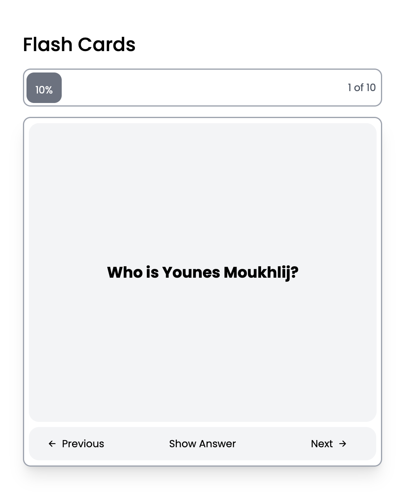
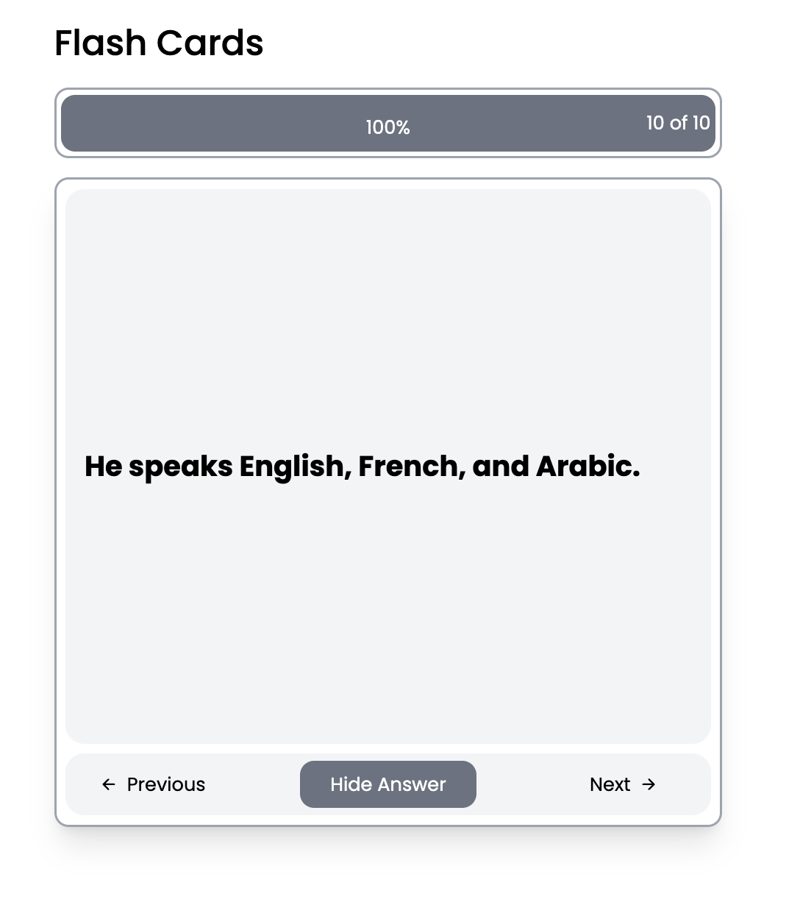

# Flash Cards App 🃏

A modern, interactive flash cards application built with React, demonstrating state management and component-based architecture. Perfect for learning and memorizing information through an engaging user interface.


<div align="center">

[✅ Back to Web Roadmap Projects ✅](https://github.com/YounesMoukhlij/web-roadmap-projects)


</div>

## 🌟 Features

- **Interactive Flash Cards**: Click to reveal answers with smooth animations
- **Progress Tracking**: Visual progress bar showing current position (X of 10 cards)
- **Navigation Controls**: Previous/Next buttons to move between cards
- **Responsive Design**: Clean, modern UI built with Tailwind CSS
- **Smooth Animations**: Card flip animations and hover effects
- **State Management**: Demonstrates React state sharing between components

## 🖼️ Screenshots

### Question View


### Answer View


## 🚀 Getting Started

### Prerequisites

- Node.js (v16 or higher)
- npm or yarn

### Installation

1. Clone the repository:
```bash
git clone https://github.com/YounesMoukhlij/Flash-Cards.git
cd Flash-Cards/flash-cards
```

2. Install dependencies:
```bash
npm install
```

3. Start the development server:
```bash
npm run dev
```

4. Open your browser and visit `http://localhost:5173`

## 🛠️ Built With

- **React 19.1.1** - UI library for building user interfaces
- **Vite 7.1.0** - Fast build tool and development server
- **Tailwind CSS 3.4.17** - Utility-first CSS framework
- **React Icons 5.5.0** - Popular icon library for React
- **PostCSS & Autoprefixer** - CSS processing and browser compatibility

## 📁 Project Structure

```
flash-cards/
├── public/
│   └── vite.svg
├── src/
│   ├── components/
│   │   ├── FlashCard.jsx    # Main card component with flip functionality
│   │   └── Header.jsx       # Progress header component
│   ├── App.jsx              # Main application component
│   ├── main.jsx            # Application entry point
│   └── style.css           # Global styles
├── index.html              # HTML template
├── package.json           # Dependencies and scripts
├── tailwind.config.js     # Tailwind CSS configuration
├── postcss.config.js      # PostCSS configuration
└── vite.config.js         # Vite configuration
```

## 🎯 Learning Objectives

This project demonstrates key React concepts:

### State Management
- **Shared State**: Uses `useState` to share data between Header and FlashCard components
- **State Lifting**: Progress tracking state is lifted up to the App component
- **Effect Hooks**: `useEffect` synchronizes card index with progress

### Component Architecture
- **Component Composition**: App component composes Header and FlashCard
- **Props Passing**: Data flows down via props, events bubble up via callbacks
- **Separation of Concerns**: Each component has a single responsibility

### User Interaction
- **Event Handling**: Click handlers for navigation and card flipping
- **Conditional Rendering**: Dynamic content based on state
- **CSS Transitions**: Smooth animations for better UX

## 🎮 Usage

1. **View Questions**: The app starts showing the first question
2. **Reveal Answers**: Click "Show Answer" to flip the card and see the answer
3. **Navigate**: Use "Previous" and "Next" buttons to move between cards
4. **Track Progress**: Monitor your progress with the visual progress bar at the top

## 🎨 Customization

### Adding New Flash Cards

Edit the `infos` array in `src/components/FlashCard.jsx`:

```jsx
const infos = [
  {
    question: "Your question here?",
    answer: "Your answer here."
  },
  // Add more cards...
]
```

### Styling

The app uses Tailwind CSS for styling. You can customize:
- Colors in `tailwind.config.js`
- Component styles directly in JSX using Tailwind classes
- Global styles in `src/style.css`

## 📜 Available Scripts

- `npm run dev` - Start development server
- `npm run build` - Build for production
- `npm run preview` - Preview production build

## 🤝 Contributing

1. Fork the repository
2. Create a feature branch (`git checkout -b feature/amazing-feature`)
3. Commit your changes (`git commit -m 'Add amazing feature'`)
4. Push to the branch (`git push origin feature/amazing-feature`)
5. Open a Pull Request

## 📝 License

This project is open source and available under the [MIT License](LICENSE).

## 👨‍💻 Author

**Younes Moukhlij**
- Software Engineering Student & PhD Researcher
- GitHub: [@YounesMoukhlij](https://github.com/YounesMoukhlij)

---

*This project serves as an educational example of React state management and component-based architecture. Perfect for beginners learning React concepts!*
